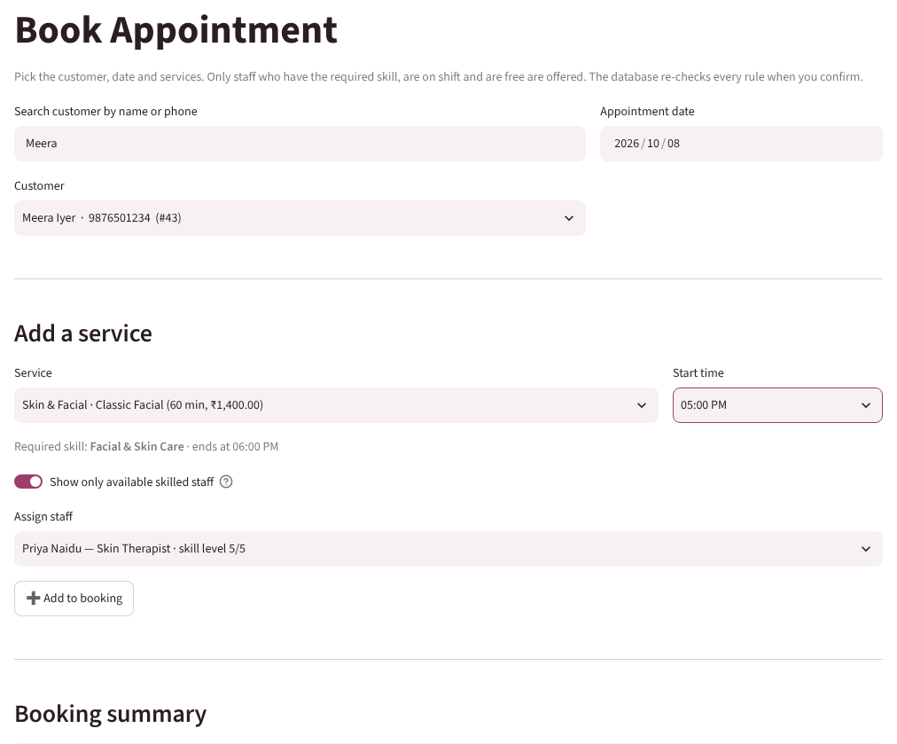
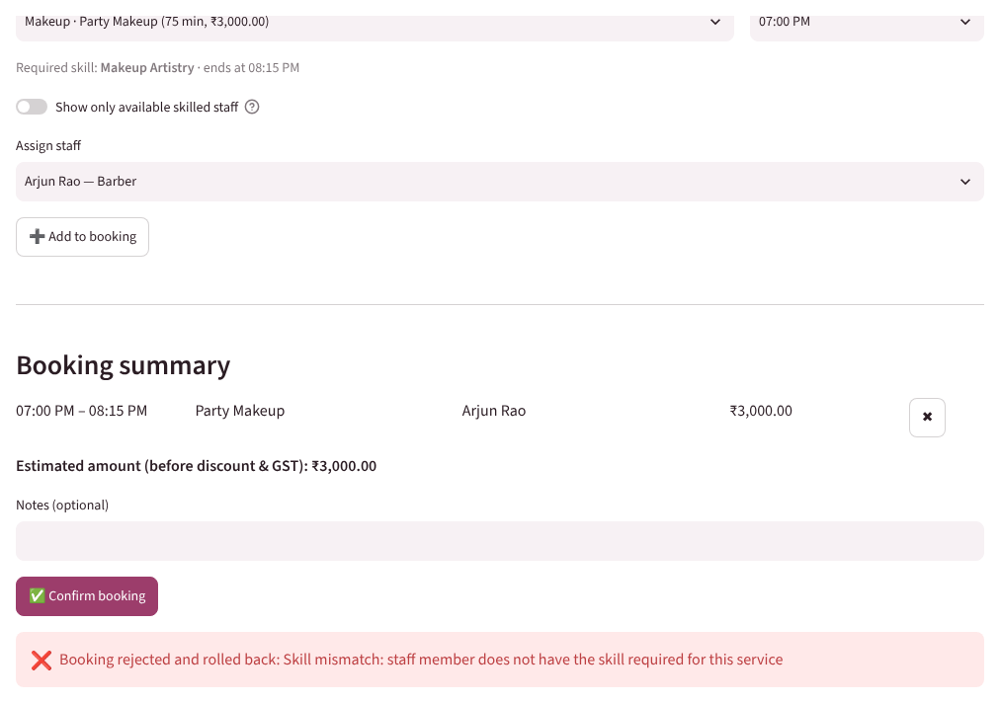
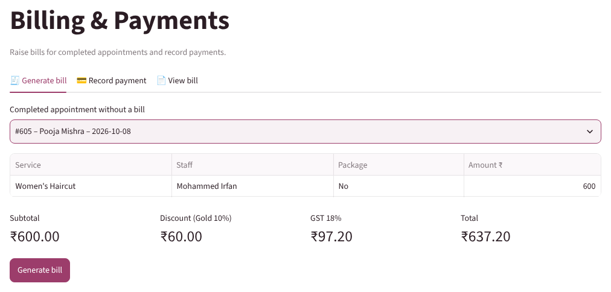
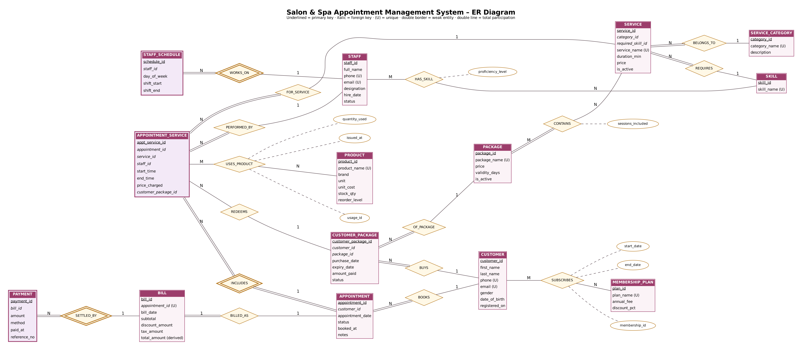

# Salon & Spa Appointment Management System — DBMS PBL (Project 66)

**Devyani Pawar · 25WU0102069 · AIML Rhinos · B.Tech CSE (AI & ML), Woxsen University**
Database Management Systems — Project-Based Learning, Academic Year 2026–27

A MySQL database and a Python (Streamlit) application that run a salon's day from booking to payment.
The five salon rules are enforced **inside the database**, so no client can break them:

| Rule | How it is enforced |
|---|---|
| No overlapping staff appointments | trigger `trg_appt_service_bi/_bu` → `sp_validate_appt_service` |
| Skill match | trigger checks `staff_skill` against `service.required_skill_id` |
| Valid appointment times | `CHECK` 09:00–21:00 + trigger: slot = duration, inside staff shift |
| Package-session limits | trigger: owner, active, not expired, sessions left |
| Payment limits | trigger `trg_payment_bi`: total paid ≤ bill total |

## Video demonstration

▶ **5-minute demo:** see [`video/VIDEO_LINK.md`](video/VIDEO_LINK.md)

## Repository contents

```
database/        SQL scripts (run salon_spa_full.sql, or 01 → 04 in order)
  01_schema.sql              18 tables, 85 constraints, 7 indexes
  02_triggers.sql            validation procedure + 5 triggers
  03_sample_data.sql         603 appointments, 40 customers, 10 staff … (generated)
  04_views.sql               7 reporting views
  05_queries.sql             20 queries: joins, subqueries, aggregation, views
  06_test_business_rules.sql 18 rule tests (runs in a transaction, rolled back)
  generate_sample_data.py    seeded generator for 03_sample_data.sql
app/             Streamlit application (streamlit_app.py, db.py, ui.py, views/)
presentations/   Review 1, Review 2, Review 3 decks (.pptx) + build script
report/          Final PBL report (.docx and .pdf)
docs/            ER diagram and relational schema diagram (+ generators)
screenshots/     Application output screens (cropped/ = used in report)
video/           Demo video link and recording script
```

## Run it

**1. Database** (MySQL 8.0+; MariaDB 10.11 also works)

```bash
mysql -u root -p < database/salon_spa_full.sql
# optional: an application user
mysql -u root -p -e "CREATE USER 'salon'@'localhost' IDENTIFIED BY 'salon123';
                     GRANT SELECT, INSERT, UPDATE, DELETE, EXECUTE ON salon_spa_db.* TO 'salon'@'localhost';"
```

On Arch Linux: `sudo pacman -S mariadb` (or install MySQL 8 from the AUR), then
`sudo mariadb-install-db --user=mysql --basedir=/usr --datadir=/var/lib/mysql && sudo systemctl start mariadb`.

**2. Application**

```bash
python -m venv .venv && source .venv/bin/activate
pip install -r requirements.txt
# credentials default to salon / salon123 on localhost; override if needed:
export SALON_DB_USER=root SALON_DB_PASSWORD=yourpassword
streamlit run app/streamlit_app.py      # opens http://localhost:8501
```

**3. Tests**

```bash
mysql -u root -p --force salon_spa_db < database/06_test_business_rules.sql
```
Expected: TC-01/03/09/13 succeed, every other case is rejected with the rule's message, and the data is rolled back.

The sample data is centred on **8 October 2026** (past visits completed, later ones booked). To reset to the clean data at any time, rerun `salon_spa_full.sql`.

## Screens

| | |
|---|---|
|  |  |
|  |  |

## ER diagram


