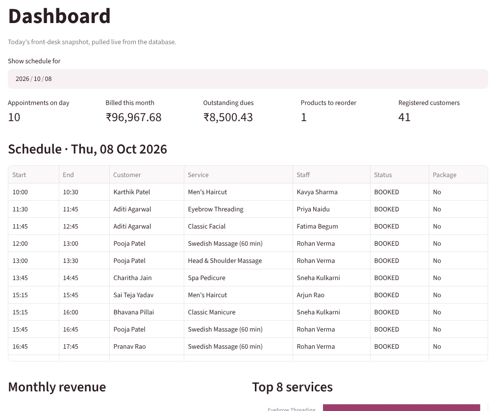
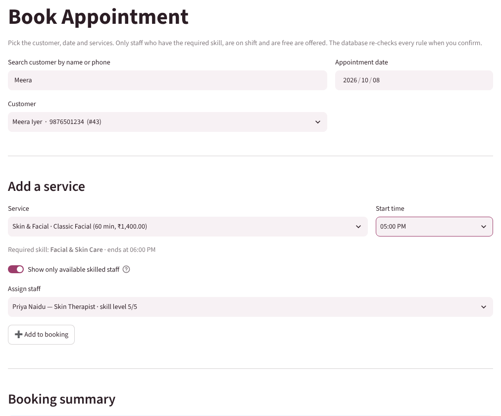

# Salon & Spa Appointment Management System — DBMS PBL (Project 66)

**Devyani Pawar · 25WU0102069 · AIML Rhinos · B.Tech CSE (AI & ML), Woxsen University**
Database Management Systems — Project-Based Learning, Academic Year 2026–27

A MySQL database and a Python (Streamlit) application that run a salon's day from booking to payment.
The five salon rules are enforced **inside the database**, so no client can break them:

| Rule | How it is enforced |
|---|---|
| No overlapping staff appointments | trigger `trg_appt_service_bi/_bu` → `sp_validate_appt_service` |
| Skill match | trigger checks `staff_skill` against `service.required_skill_id` |
| Valid appointment times | `CHECK` 09:00–21:00 + trigger: slot = duration, inside staff shift |
| Package-session limits | trigger: owner, active, not expired, sessions left |
| Payment limits | trigger `trg_payment_bi`: total paid ≤ bill total |

## Video demonstration

▶ **5-minute demo:** link in [`video/VIDEO_LINK.md`](video/VIDEO_LINK.md)

## Repository contents

```
presentations/   Review 1 (Week 7), Review 2 (Week 11), Review 3 – Final (Week 16) decks
report/          Final PBL report (.docx and .pdf)
database/        SQL scripts — run salon_spa_full.sql, or 01 → 04 in order
  01_schema.sql              18 tables, 85 constraints, 7 indexes
  02_triggers.sql            validation procedure + 5 business-rule triggers
  03_sample_data.sql         603 appointments, 40 customers, 10 staff …
  04_views.sql               7 reporting views
  05_queries.sql             20 queries: joins, subqueries, aggregation, views
  06_test_business_rules.sql 18 rule tests (runs in a transaction, rolled back)
  generate_sample_data.py    seeded generator that produced 03_sample_data.sql
app/             Python + Streamlit application (streamlit_app.py, db.py, ui.py, views/)
docs/            ER diagram and relational schema diagram
screenshots/     Application output screens used in the report
video/           Link to the 5-minute demonstration video
```

## Run it

Repository: https://github.com/devyanipawar9003-max/DBMS_PBL

**1. Database** (MySQL 8.0+; MariaDB 10.11 also works)

macOS (Homebrew):
```bash
brew install mysql python
brew services start mysql
mysql -u root < database/salon_spa_full.sql
mysql -u root -e "CREATE USER 'salon'@'localhost' IDENTIFIED BY 'salon123';
                  GRANT SELECT, INSERT, UPDATE, DELETE, EXECUTE ON salon_spa_db.* TO 'salon'@'localhost';"
```
Linux / Windows: install MySQL 8 (or MariaDB), then run the same two `mysql` commands (add `-p` if root has a password).

**2. Application**

```bash
python3 -m venv .venv && source .venv/bin/activate      # Windows: .venv\Scripts\activate
pip install -r requirements.txt
# credentials default to salon / salon123 on localhost; override if needed:
export SALON_DB_USER=root SALON_DB_PASSWORD=yourpassword
streamlit run app/streamlit_app.py      # opens http://localhost:8501
```

**3. Tests**

```bash
mysql -u root -p --force salon_spa_db < database/06_test_business_rules.sql
```
Expected: TC-01/03/09/13 succeed, every other case is rejected with the rule's message, and the data is rolled back.

The sample data is centred on **8 October 2026** (past visits completed, later ones booked). To reset to the clean data at any time, rerun `salon_spa_full.sql`.

## Screens

| | |
|---|---|
|  |  |
|  |  |

## ER diagram


